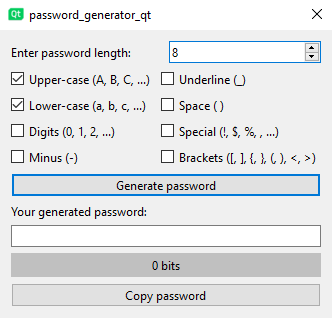
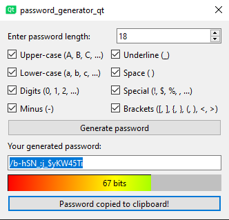
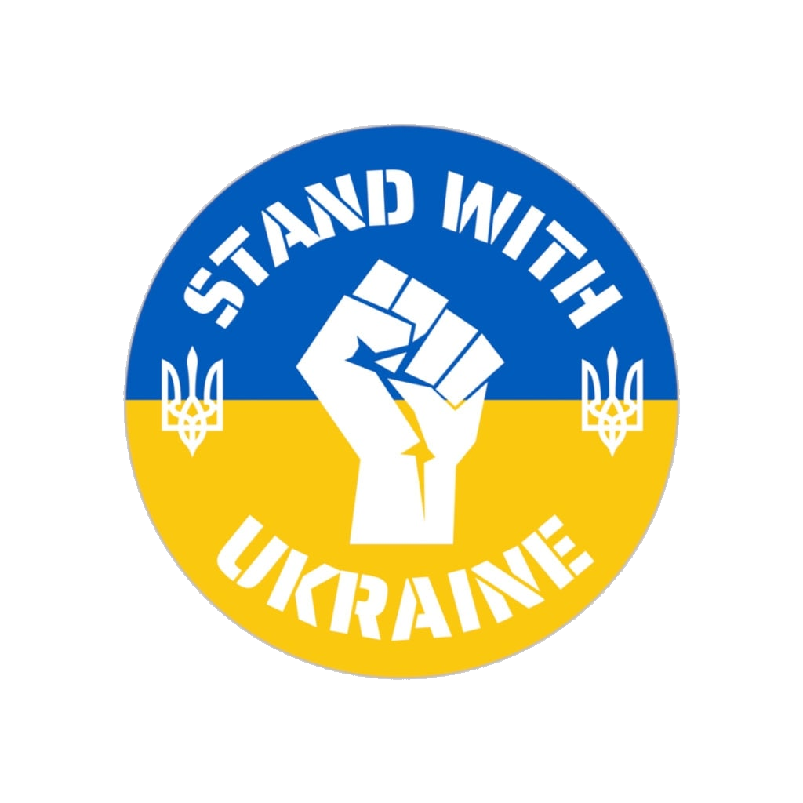

# QtPasswordGenerator

## Description
**QtPasswordGenerator** is a simple 
password generation tool based on the [Qt 
framework](https://www.qt.io/product/framework). The program allows you to 
generate secure passwords of different 
lengths and complexity using different 
character sets.

## Functional features
- Generate passwords of a specified length
- Use of different character sets (Latin letters, numbers, special characters)
- Customize password parameters (length, character types)
- Simple and intuitive graphical interface

## Screenshots




_(The theme automatically adjusts to the system)_

## Requirements
- Qt 5.15 or newer
- C++ 11 or newer

## Installation
1. Cloning a repository:

```bash
git clone https://github.com/MOsinskyi/QtPasswordGenerator.git
```

2. Build project:

```bash
cd QtPasswordGenerator
cmake --build
```

3. Run program:

```bash
./QtPasswordGenerator
```
## To use
- Open the program
- Select the necessary options for generating a password
- Click the Generate button
- Copy the generated password

## Contribution
_We welcome contributions from the community! If you want to improve the project, please create a pull request or open a 
new issue._

- Fork the repository
- Create a new branch (`git checkout -b feature/AmazingFeature`)
- Commit (`git commit -m 'Add some AmazingFeature'`)
- Push the branch (`git push origin feature/AmazingFeature`)
- Open a pull request

## License
This project is licensed under the [MIT License](https://github.com/MOsinskyi/QtPasswordGenerator/blob/master/LICENSE).

## Contacts
Author: [MOsinskyi](https://github.com/MOsinskyi)

E-mail: [maximosinskiy@gmail.com](mailto::maximosinskiy@gmail.com)

